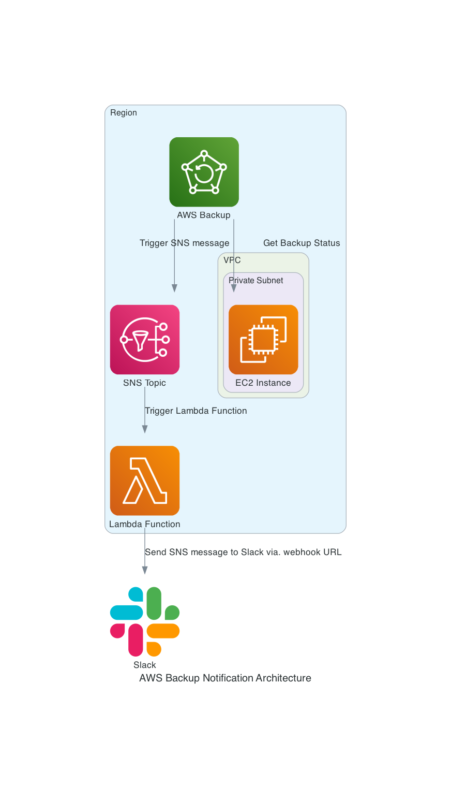

# AWS Backup Testing

## Introduction and Goals

My use case for this project was wiring up notifications from AWS Backup to Slack, which I focused on implementing using EC2 backups for ease of use in learning the service and its Terraform resources, etc. Turns out there's a convenient Terraform resource for AWS Backup vault notifications! From there, I decided on using a Lambda in Python to process the notifications, as that's a nice and simple way to do it.
Figuring out wiring up the lambda to Slack and the particularly special new thing to me of serverless framework deployment was a chunk of the work, including figuring out working with passed-in params from Terraform output and other wrinkles. Finally, scripted out deploying the infrastructure, running a test and cleaning it all up.

## Features

- Infrastructure code with Terraform for AWS Backup.
- Lambda code configured up by Serverless Framework for parsing notifications and sending to Slack.
- Deploy and teardown scripts.

## Key Technologies Used

- Terraform
- AWS Lambda
- Serverless Framework

## How It Works

- `entrypoint.sh` is a bash script that will set up the necessary infrastructure and then run an on-demand AWS Backup job using a test EC2 instance to be sent to Slack by the Lambda via. Slack webhook. This takes a bit longer than it ought to because I was hitting issues with the Lambda losing its subscription to the SNS topic so there's a line in there to delete the Serverless app CloudFormation stack before recreating it that I'd say it optional if you don't find that you hit that.
- `main.tf` handle most of the infrastructure. It's a minimal set to the best of my reckoning.
- `serverless.yaml` sets up the Lambda and some attendant resources and links between services(including the mentioned subscription -- and ability to call -- between SNS and Lambda mostly.)
- `handler.py` receives an SNS message event as a trigger, parses and sends it to a Slack webhook.
- `cleanup.sh` cleans up the resources and any running or just created but not yet run jobs.

## How To Use

- Dependencies: AWS CLI, Terraform, node, npm and [Serverless Framework](https://www.serverless.com/framework/docs)(`npm i serverless -g`) with AWS admin credentials set up.
- Create a Slack App and replace `SLACK_ENDPOINT` with your Slack webhook URL in `serverless.yaml`.
- `entrypoint.sh` should work with a stage (`dev` is the default for serverless) and a region(`us-east-1` is the default as well but I didn't just set it all to defaults since I'm working out of `us-west-2`.)
- `cleanup.sh` to clean up.

## Things I Learned

- Got some familiarity with Backup -- its start/completion windows, how it handles deleting vaults, the Default vault popped up for a moment there, and more. The docs aren't the best, including a table they have listing the supported events for Notifications which is incorrect, not listing `BACKUP_JOB_FAILED` very critically.
- Took a couple of different approaches including looking at EventBridge before deciding on an SNS topic to a Lambda for simplicity. Originally had more code for various things like more logging but cut it down in the end.
- Worked on some bash, learned or recalled some good AWS CLI syntax like `aws ec2 wait instance-status-ok` is helpful to remember.

## TO DO

- Work with other services and Backup.
- Add to 'Resources' section.

## Resources
